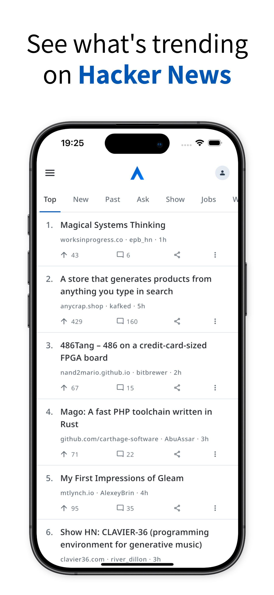
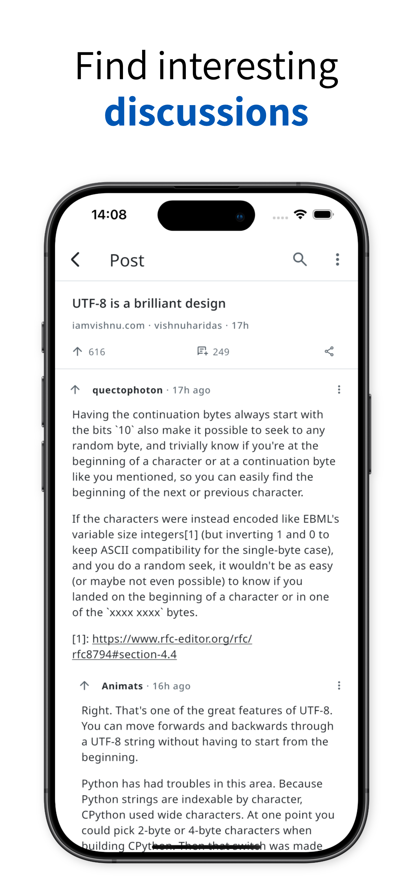
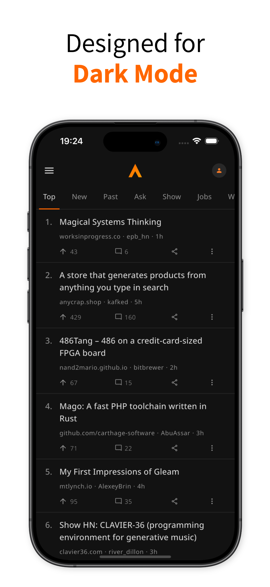

# Axiom - Hacker News

Axiom is a thoughtfully designed, performant mobile client for Hacker News. It's built to be an intuitive, mobile-friendly extension of the HN web experience. 

<table>
  <tr>
    <td></td>
    <td></td>
    <td></td>
  </tr>
</table>

## Get the app (beta)

**iOS**:
Join the open beta on [TestFlight](https://testflight.apple.com/join/44cHjDBb)

**Android**
1. First, join the [testing group on Google Groups](https://groups.google.com/g/axiom-hacker-news) (required for beta access)
2. Then, [install the app from the Play Store](https://play.google.com/store/apps/details?id=com.lukasmirbt.hackerclient)

## Design philosophy

- Thoughtful design over endless customization
- Perform as well as, or better than, HN Web
- Be an extension, not a replacement, of HN Web

## Features

👀 **Discover & read**  
Browse top, new, and other classic HN sections

💬 **Join the discussion**  
Read, collapse, and search through comments

✍️ **Comment & reply**  
Share your thoughts with the community

💾 **Automatic drafts**  
Never lose a thought - your replies are saved automatically

🌙 **Dark Mode**  
Designed from the ground up for a beautiful dark mode experience

## Feedback & contributions
The project is being actively developed and your input is greatly appreciated!

### Bug reports & Feature requests
See something wrong or have a great idea? [Please open an issue](https://github.com/LukasMirbt/hacker_news/issues).