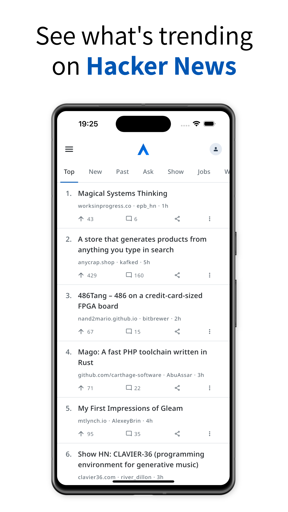

# Axiom - Hacker News

## Get the app (beta)

Join the open beta on iOS: https://testflight.apple.com/join/44cHjDBb

Join the beta on Android:

1. Join the testing group (required): https://groups.google.com/g/axiom-hacker-news
2. Install the app: https://play.google.com/store/apps/details?id=com.lukasmirbt.hackerclient

## Design philosophy

- Thoughtful design over customization
- Perform as good, or better than, HN Web
- Be an extension, not a replacement of, HN Web

## What can I do with Axiom?

- Discover articles
- Read posts and discussions 
- Search comments
- Comment and reply
- Save drafts automatically
- Login to Hacker News
- Search posts (hn.algolia.com)
- Dark mode